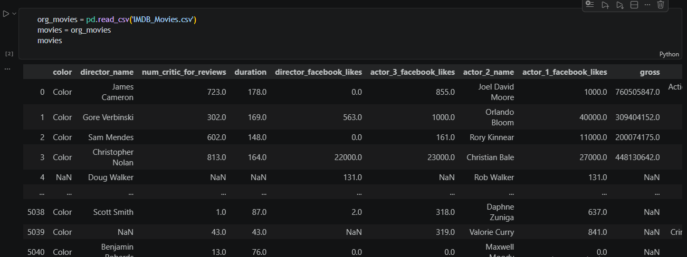
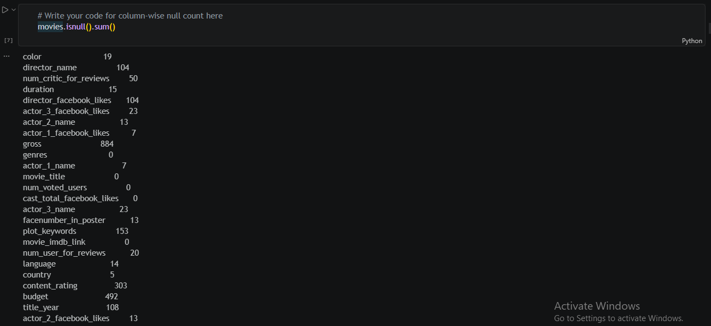
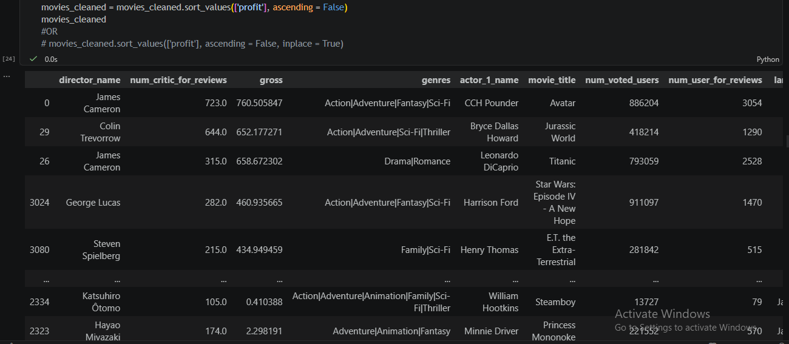
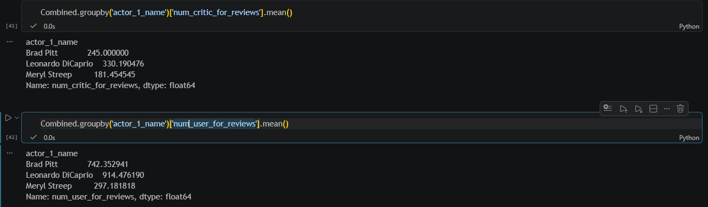

# IMDB Movie Analysis Using Python

## Project Overview

This project performs Exploratory Data Analysis (EDA) on IMDB movie data using Python and Pandas to uncover trends related to movie profitability, genres, actors, languages, and audience preferences.

The project focuses on data cleaning, transformation, and business insights extraction from movie industry data.

---

## Tools & Libraries Used

- Python
- Pandas
- NumPy
- Jupyter Notebook

---

## Dataset Information

The dataset contains movie-related information such as:

- Movie Titles
- Genres
- Budget
- Gross Revenue
- Language
- Actors
- IMDB Ratings
- Facebook Likes
- Critic Reviews

---

## Data Cleaning Performed

- Null value analysis
- Missing value handling
- Duplicate removal
- Data transformation
- Budget & revenue standardization

---

## Analysis Performed

### Profitability Analysis
- Identified top profitable movies
- Compared movie budgets and revenues

### Genre Analysis
- Analyzed popular movie genres
- Studied genre combinations

### Language Analysis
- Explored foreign language movie trends

### Actor Analysis
Compared audience and critic preferences for actors such as:
- Leonardo DiCaprio
- Brad Pitt
- Meryl Streep

---

## Key Insights

- Avatar is the most profitable movie with a profit of $523.5 M followed by Jurassic World and Titanic
- The Shawshank Redemption has the highest IMDB Score of 9.3 followed by The Godfater and The Dark Knight
- Family + Sci-Fi is the most popular combo of genres
- Leonardo DiCaprio has highest average critic reviews and highest average user reviews.
- This suggests his movies generate stronger public attention
- Highly profitable movies are not always the highest-budget films

---

## Project Screenshots

### Dataset Overview

### Null Value Overview

### Top Profitable Movies

### Actor Analysis

---

## Future Improvements

- Build recommendation system
- Perform sentiment analysis on movie reviews
- Create interactive dashboard
